# PickShot 개발 진행사항 및 설계 대비 변경사항 리포트

> 기준 문서: [project.md](file:///c:/d/PickShot/project.md) (v2.0)
> 작성 시점: 2026-08-28

---

## 📊 전체 진행률 요약

| 영역 | 설계 항목 수 | 구현 완료 | 부분 구현 | 미구현 | 진행률 |
|------|:-----------:|:---------:|:---------:|:------:|:------:|
| **프론트엔드 (3.1)** | 5 | 4 | 1 | 0 | ~90% |
| **백엔드 & AI (3.2)** | 3 | 2 | 1 | 0 | ~70% |
| **데이터셋 & DB (4)** | 3 | 3 | 0 | 0 | 100% |
| **비기능 요구사항 (5)** | 2 | 1 | 1 | 0 | ~75% |
| **전체** | **13** | **10** | **3** | **0** | **~85%** |

---

## ✅ 구현 완료 항목

### 프론트엔드 (3.1)

#### 1. 대량 파일 로더 및 OOM 방어
- **설계**: Web Worker 슬라이딩 윈도우 청크 파이프라인, 1,000장 이상 업로드 시 UI 프리징 방지
- **구현**: ✅ 완료
  - [useFileLoader.ts](file:///c:/d/PickShot/frontend/src/hooks/useFileLoader.ts): `chunkArray` 기반 배치 처리 (50장 단위)
  - [thumbnail.worker.ts](file:///c:/d/PickShot/frontend/src/workers/thumbnail.worker.ts): Web Worker + `OffscreenCanvas` + `createImageBitmap` → WebP Blob 생성 후 `bitmap.close()` 즉시 해제
  - [DropZone.tsx](file:///c:/d/PickShot/frontend/src/components/upload/DropZone.tsx): 드래그 앤 드롭 UI

#### 2. 상태 휘발성 통제 (IndexedDB 복원력)
- **설계**: IndexedDB 체크포인트, `beforeunload` 이벤트, 새로고침 시 100% 복구
- **구현**: ✅ 완료
  - [useIndexedDB.ts](file:///c:/d/PickShot/frontend/src/hooks/useIndexedDB.ts): `saveCheckpoint()` / `restoreCheckpoint()` 구현
  - `beforeunload` 이벤트 리스너 등록 완료
  - 직렬화 시 `File`/`Blob` 제외하여 IndexedDB 용량 초과 방지

#### 3. 클라이언트 단 고속 클러스터링
- **설계**: EXIF `DateTimeOriginal` 1차 클러스터링 + WASM pHash/컬러 히스토그램 2차 클러스터링
- **구현**: ⚠️ **부분 완료 (1차만)**
  - [useClustering.ts](file:///c:/d/PickShot/frontend/src/hooks/useClustering.ts): EXIF 타임스탬프 기반 시간차 임계값(8초) 그룹화 ✅
  - [clustering.worker.ts](file:///c:/d/PickShot/frontend/src/workers/clustering.worker.ts): 존재하나 스캐폴드 수준
  - ❌ **WASM pHash / 컬러 히스토그램 2차 클러스터링 미구현** (EXIF 없는 이미지 fallback 부재)

> [!IMPORTANT]
> EXIF 데이터가 없는 이미지(스크린샷, SNS 다운로드 등)는 `lastModified` 타임스탬프에만 의존하므로 클러스터링 품질이 크게 저하됩니다. pHash 보조 클러스터링이 필요합니다.

#### 4. 뷰어 인터페이스 및 Attention 트래킹
- **설계**: 그룹별 썸네일 그리드 + 줌인 비교 모달 + 확대 좌표(x, y) 및 배율 로깅
- **구현**: ✅ 완료
  - [GroupGrid.tsx](file:///c:/d/PickShot/frontend/src/components/viewer/GroupGrid.tsx): 그룹별 썸네일 그리드 뷰
  - [CompareModal.tsx](file:///c:/d/PickShot/frontend/src/components/viewer/CompareModal.tsx): 줌인 비교 모달 (휠 줌 + 드래그 팬 + 키보드 네비게이션)
  - [useZoomTracker.ts](file:///c:/d/PickShot/frontend/src/hooks/useZoomTracker.ts): 줌인 좌표/배율 로깅 → `curationStore.logZoom()` 적재

#### 5. Zero-Egress 파일 처리
- **설계**: `showDirectoryPicker()` File System Access API로 선택 원본 로컬 직접 저장
- **구현**: ✅ 완료
  - [fileSystem.ts](file:///c:/d/PickShot/frontend/src/services/fileSystem.ts): `saveFilesToDirectory()` 구현
  - [ResultPage.tsx](file:///c:/d/PickShot/frontend/src/pages/ResultPage.tsx): Zero-Egress 저장 + 진행률 표시 + 피드백 전송

---

### 백엔드 & AI 파이프라인 (3.2)

#### 6. API 인터페이스
- **설계**: `POST /api/v1/curate`, `GET /api/v1/stream` (SSE), `POST /api/v1/feedback`
- **구현**: ✅ 완료
  - [curate.py](file:///c:/d/PickShot/backend/app/api/v1/curate.py): 그룹 단위 청크 수신
  - [stream.py](file:///c:/d/PickShot/backend/app/api/v1/stream.py): SSE 스트리밍 엔드포인트
  - [feedback.py](file:///c:/d/PickShot/backend/app/api/v1/feedback.py): 사용자 피드백 + Attention 데이터 적재
  - [api.ts](file:///c:/d/PickShot/frontend/src/services/api.ts): 프론트엔드 API 클라이언트 매핑 완료

#### 7. AI 평가 엔진 (2-Track)
- **설계**: Hard Filter (MediaPipe Face Mesh + OpenCV Laplacian) → Preference Ranker (CLIP/DINO Pairwise Ranking)
- **구현**: ⚠️ **부분 구현 (Hard Filter만 실제 동작)**
  - [hard_filter.py](file:///c:/d/PickShot/backend/app/services/hard_filter.py): OpenCV Laplacian Variance 블러 감지 ✅ / MediaPipe Face Mesh는 **스코어 하드코딩** (`face_score = 0.95`)
  - [preference_ranker.py](file:///c:/d/PickShot/backend/app/services/preference_ranker.py): **전체 플레이스홀더** (`scores[img_id] = 0.85` 고정값)
  - [evaluation_pipeline.py](file:///c:/d/PickShot/backend/app/services/evaluation_pipeline.py): 파이프라인 오케스트레이션 완료, 가중치 합산 (`face × 0.4 + pref × 0.6`) ✅

> [!WARNING]
> **Preference Ranker가 완전히 플레이스홀더**입니다. 현재는 모든 이미지에 동일한 `0.85` 점수가 부여되어, AI 추천이 실질적으로 블러 감지(Laplacian)에만 의존합니다. CLIP/DINO 모델 통합이 필요합니다.

> [!NOTE]
> **Hard Filter의 MediaPipe Face Mesh**도 아직 플레이스홀더입니다. 다인원 가중치(BBox 상위 1~2명 감점 룰셋) 로직이 설계에는 명시되어 있지만 미구현 상태입니다.

---

### 데이터셋 & DB (4)

#### 8. DB 스키마
- **설계**: Groups / Images / Preferences 테이블 (PostgreSQL)
- **구현**: ✅ 완료
  - [database.py](file:///c:/d/PickShot/backend/app/models/database.py): SQLAlchemy ORM 모델 3개 정확히 매핑
    - `GroupModel`: `id`, `user_id`, `created_at`
    - `ImageModel`: `id`, `group_id`, `storage_path`, `face_score`, `sharpness_score`, `total_score`
    - `PreferenceModel`: `winner_image_id`, `loser_image_ids` (JSON), `is_user_modified`, `zoom_attention_x`, `zoom_attention_y`, `zoom_attention_scale`

---

### 비기능 요구사항 (5)

#### 9. 성능 및 안정성
- **설계**: 단일 HTTP 페이로드 10MB 미만 제어, JSZip 사용 금지
- **구현**: ✅ 완료 — JSZip 미사용, File System Access API 직접 쓰기 원칙 준수

#### 10. 개인정보 동의 UI
- **설계**: 업로드 전 데이터 활용 동의 팝업 (1080px 리사이즈 썸네일만 전송, 원본 비전송 강조)
- **구현**: ✅ 완료
  - [ConsentDialog.tsx](file:///c:/d/PickShot/frontend/src/components/common/ConsentDialog.tsx): 동의 다이얼로그 구현

---

## 🔄 설계 대비 변경 및 추가 사항

설계 문서(project.md)에는 없지만, 개발 과정에서 **사용자 피드백 기반으로 추가된 기능**들입니다:

| 변경/추가 사항 | 설명 | 관련 파일 |
|---------------|------|----------|
| **🔀 그룹 간 드래그 & 드롭** | 사진을 다른 그룹으로 드래그하여 이동 가능 | [ImageCard.tsx](file:///c:/d/PickShot/frontend/src/components/viewer/ImageCard.tsx), [GroupGrid.tsx](file:///c:/d/PickShot/frontend/src/components/viewer/GroupGrid.tsx) |
| **🔗 그룹 병합 / ➕ 새 그룹 생성** | 인접 그룹 간 병합 버튼 및 사이에 빈 그룹 삽입 | [curationStore.ts](file:///c:/d/PickShot/frontend/src/stores/curationStore.ts) (`mergeGroups`, `createGroupBetween`, `deleteGroup`) |
| **☑️ 멀티 베스트 컷 선택** | 기존: 그룹당 1장 → 변경: 체크박스로 여러 장 선택 가능 | `bestImageIds: string[]` 추가 ([image.ts](file:///c:/d/PickShot/frontend/src/types/image.ts)) |
| **🤖 AI 추천 vs 사용자 선택 분리** | AI 추천 라벨(`✨ AI 추천`) 고정 + 사용자 체크박스 독립 조작 | `aiSuggestedBestId` 필드 추가, [BestPickBadge.tsx](file:///c:/d/PickShot/frontend/src/components/viewer/BestPickBadge.tsx) |
| **🔍 GPU 가속 줌/팬** | `requestAnimationFrame` + `translate3d` + `will-change` 기반 고성능 뷰어 | [CompareModal.tsx](file:///c:/d/PickShot/frontend/src/components/viewer/CompareModal.tsx) |
| **🐳 Docker 개발 환경** | 볼륨 마운트 + HMR 핫 리로드 개발용 설정 추가 | [docker-compose.yml](file:///c:/d/PickShot/docker-compose.yml), [Dockerfile.dev](file:///c:/d/PickShot/frontend/Dockerfile.dev) |

---

## 🚧 미구현 / 보강 필요 항목 (우선순위순)

### 🔴 높음 (High Priority)

| # | 항목 | 설계 위치 | 현재 상태 | 설명 |
|---|------|----------|----------|------|
| 1 | **CLIP/DINO Preference Ranker** | §3.2 AI 평가 엔진 | 플레이스홀더 (고정값 `0.85`) | AI 추천의 핵심 차별화 기능. 현재 블러 감지만으로 추천 |
| 2 | **MediaPipe Face Mesh 실제 통합** | §3.2 Hard Filter | 플레이스홀더 (`face_score = 0.95`) | 눈 감김/표정 감점이 작동하지 않음 |
| 3 | **다인원 BBox 가중치** | §3.2 | 미구현 | 단체사진 시 주요 피사체 1~2명 식별 로직 없음 |

### 🟡 중간 (Medium Priority)

| # | 항목 | 설계 위치 | 현재 상태 | 설명 |
|---|------|----------|----------|------|
| 4 | **WASM pHash 2차 클러스터링** | §3.1 클러스터링 | 미구현 | EXIF 없는 이미지의 유사도 기반 그룹화 불가 |
| 5 | **10MB 페이로드 제한 강제** | §5 | 부분 구현 | 프론트엔드에서 명시적 사이즈 체크 미적용 (청크 분할은 있으나 크기 기반 검증 부재) |
| 6 | **SSE 기반 점진적 렌더링** | §2 (8단계) | 스캐폴드 | SSE 훅(`useSSE.ts`)은 있으나 실제 그룹 → 서버 전송 → SSE 응답 → 순차 렌더링 E2E 흐름 미검증 |

### 🟢 낮음 (Low Priority)

| # | 항목 | 설계 위치 | 현재 상태 | 설명 |
|---|------|----------|----------|------|
| 7 | **`beforeunload` 경고 다이얼로그** | §2 (2단계) | 부분 구현 | 체크포인트 저장은 하나 사용자 경고 confirm 미표시 |
| 8 | **URL.revokeObjectURL 적극 해제** | §2 (3단계) | Worker 내 `bitmap.close()` 있음 | 그 외 컴포넌트 내 Blob URL 해제 보강 필요 |

---

## 🏗️ 아키텍처 구조 대조

```mermaid
graph TD
    subgraph "설계 (project.md)"
        A1["1. 대량 파일 로딩<br/>청크 슬라이딩 윈도우"] --> A2["2. beforeunload<br/>IndexedDB 체크포인트"]
        A2 --> A3["3. EXIF 클러스터링<br/>+ pHash 2차"]
        A3 --> A4["4. 썸네일 청크 전송<br/>POST /curate"]
        A4 --> A5["5. AI 평가<br/>Hard Filter + Ranker"]
        A5 --> A6["6. SSE 실시간 결과"]
        A6 --> A7["7. 점진적 렌더링<br/>그룹별 추천 표시"]
        A7 --> A8["8. Zero-Egress 저장"]
        A8 --> A9["9. 피드백 + Attention<br/>POST /feedback"]
    end

    subgraph "구현 상태"
        B1["✅ 청크 로딩"] --> B2["✅ IndexedDB"]
        B2 --> B3["⚠️ EXIF만<br/>pHash 미구현"]
        B3 --> B4["✅ API 엔드포인트"]
        B4 --> B5["⚠️ Laplacian만<br/>CLIP/DINO 미구현"]
        B5 --> B6["✅ SSE 스캐폴드"]
        B6 --> B7["✅ 그룹 그리드 + 모달"]
        B7 --> B8["✅ File System API"]
        B8 --> B9["✅ 피드백 전송"]
    end

    style B3 fill:#fbbf24,color:#000
    style B5 fill:#f87171,color:#000
```

---

## 📝 결론

전체적으로 **프론트엔드 UI/UX와 E2E 파이프라인 구조는 ~90% 완성**되어 있으며, 사용자 피드백 기반의 추가 기능(드래그&드롭, 멀티 베스트, AI/사용자 선택 분리)도 잘 반영되어 있습니다.

**핵심 미완성 영역은 백엔드 AI 모델 통합**(CLIP/DINO Preference Ranker, MediaPipe Face Mesh, 다인원 가중치)과 **클라이언트 2차 클러스터링(pHash)**으로, 이 부분이 해결되면 설계 명세서 대비 기능 완성도가 100%에 도달합니다.
